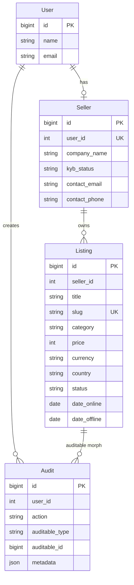
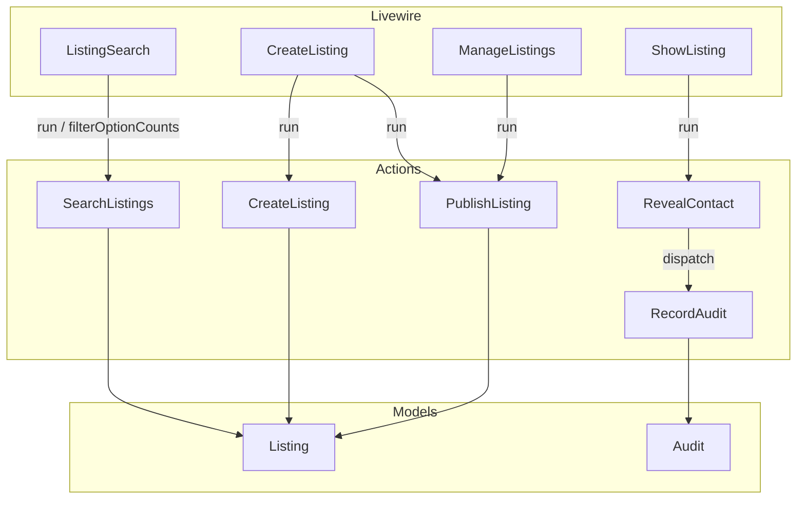
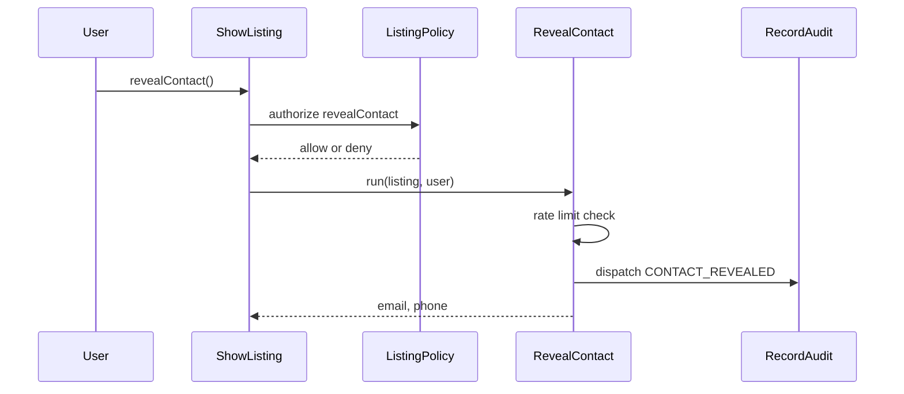
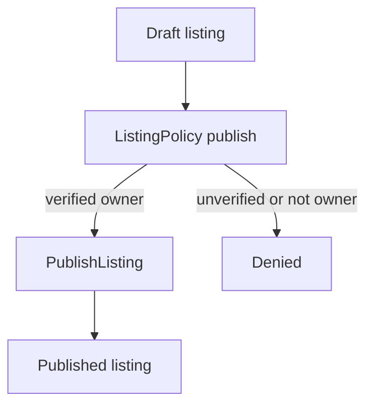

# Kinkoza — B2B Marketplace POC

Proof of concept for a pan-European B2B asset marketplace. Three core pages (search, listing detail, create listing), plus bonus features: KYB publish gate, English/French localization, CI pipeline, and Scout + Typesense title search.

## Requirements


| Requirement | Version                        |
| ----------- | ------------------------------ |
| PHP         | 8.4+                           |
| Laravel     | 13.x                           |
| Node.js     | 24+                            |
| npm         | Latest compatible with Node 24 |
| Composer    | 2.x                            |
| Git         | 2.x                            |
| Typesense   | Cloud account (or any Typesense-compatible host) |


Tests use SQLite in-memory (`phpunit.xml`) and Scout’s `collection` driver. Local development uses MySQL (`DB_CONNECTION=mysql` in `.env.example`).

## Installation

1. Clone the repository and enter the project directory.
2. Install PHP dependencies:

   ```bash
   composer install
   ```

3. Copy the environment file and generate an application key:

   ```bash
   cp .env.example .env
   php artisan key:generate
   ```

4. Create a MySQL database named `kinkoza` and set `DB_*` values in `.env` (defaults match `.env.example`: host `127.0.0.1`, port `3306`, user `root`, empty password).
5. Run migrations and seed demo data:

   ```bash
   php artisan migrate --seed
   ```

6. For live title search, create a [Typesense Cloud](https://cloud.typesense.org/) cluster, set `TYPESENSE_*` and `SCOUT_DRIVER=typesense` in `.env` (host without `https://`; Cloud usually uses port `443` and protocol `https`), then import listings:

   ```bash
   php artisan scout:import "App\Models\Listing"
   ```

   Without Typesense credentials, browsing and filters still work; title search needs a reachable Typesense host. You can point the same env vars at a self-hosted Typesense instance later without code changes.

7. Install frontend dependencies and build assets:

   ```bash
   npm ci
   npm run build
   ```

8. Start the application:

   ```bash
   php artisan serve
   ```

Open [http://localhost:8000](http://localhost:8000).

`composer setup` installs dependencies, generates a key, runs migrations, and builds assets — but does **not** seed the database. Run `php artisan db:seed` separately if you use it.

## Demo Credentials

All seeded users share the password `password` (set in `UserFactory`).


| Email                     | Seller profile | KYB status |
| ------------------------- | -------------- | ---------- |
| `verified@kinkoza.test`   | Yes            | Verified   |
| `unverified@kinkoza.test` | Yes            | Pending    |
| `buyer@kinkoza.test`      | No             | —          |


- **Verified seller** — can create drafts and publish listings.
- **Unverified seller** — can create drafts; publish is denied by policy.
- **Buyer** — no seller profile; can browse and reveal contact on published listings.

## Routes


| Path               | Purpose                                   |
| ------------------ | ----------------------------------------- |
| `/`                | Listing search (landing page)             |
| `/listings/{slug}` | Listing detail and contact reveal         |
| `/listings/create` | Create listing (auth, seller only)        |
| `/listings/manage` | Manage seller listings and publish drafts |
| `/locale/{locale}` | Switch locale (`en` or `fr`)              |


Auth routes (login, register) are provided by Laravel Breeze.

## Architecture

Domain operations live in `lorisleiva/laravel-actions` classes. I had not used this package before; I chose it for this challenge to get familiar with tooling Kinkoza uses day-to-day. Livewire components stay thin and call actions via `::run()` or `::dispatch()`.

### Domain entities




- `User` → `Seller` (optional 1:1 via `user_id` unique on sellers)
- `Seller` → `Listing` (1:n)
- `Audit` is polymorphic (`auditable`); contact reveals currently target listings

### Application flow




### Livewire → actions


| Livewire         | Calls                                                                                            |
| ---------------- | ------------------------------------------------------------------------------------------------ |
| `ListingSearch`  | `SearchListings::run()`, `SearchListings::make()->filterOptionCounts()`                          |
| `ShowListing`    | `RevealContact::run()` after `authorize('revealContact')`                                        |
| `CreateListing`  | `CreateListing::run()`; `PublishListing::run()` on `saveAndPublish` after `authorize('publish')` |
| `ManageListings` | `PublishListing::run()` after ownership-scoped lookup and `authorize('publish')`                 |


### Authorization

`ListingPolicy` abilities:


| Ability             | Rule                                          |
| ------------------- | --------------------------------------------- |
| `view`              | Published and within publication window       |
| `create`            | User has a seller profile                     |
| `update` / `delete` | Owns the listing                              |
| `publish`           | Owns draft + seller KYB verified              |
| `revealContact`     | Can view listing and is not the listing owner |


Enforced at:

- Routes: `can:create,Listing` on create/manage; `can:view,listing` on detail
- Livewire methods: `publish`, `revealContact`, `saveAndPublish`

### Enums


| Enum              | Values                                                                      |
| ----------------- | --------------------------------------------------------------------------- |
| `ListingCategory` | machinery_equipment, vehicles_fleet, commercial_property, intangible_assets |
| `ListingStatus`   | draft, pending_review, published, expired                                   |
| `Currency`        | eur, usd                                                                    |
| `Country`         | fr, be, lu                                                                  |
| `KybStatus`       | pending, verified, rejected                                                 |
| `ListingSort`     | price_asc, price_desc, newest, oldest                                       |
| `AuditAction`     | contact_revealed                                                            |


### Laravel 13 practices used

- Application config and middleware in `bootstrap/app.php` (`SetLocale` on the web stack)
- Backed enums with model `casts()`
- `#[Fillable]` / `#[Hidden]` on models
- `#[Scope]` on `Listing`: `published`, `withinPublicationWindow`, `ownedBy`
- Price attribute accessor (cents in DB, major units in app)
- `Model::shouldBeStrict()` outside production (`AppServiceProvider`)
- Sluggable slug from title (`cviebrock/eloquent-sluggable`)
- Laravel Scout + Typesense for title search (`Searchable` on `Listing`)

## Search and Query Design

Search is handled by `SearchListings`, called from `ListingSearch`.

### Base query

Every search starts with:

- `published()` — `status = published`
- `withinPublicationWindow()` — `date_online <= today` and `date_offline >= today` at the database level

### Filters


| Filter          | Behaviour                                               |
| --------------- | ------------------------------------------------------- |
| Title           | Laravel Scout (`Listing::search`) when `q` is non-empty |
| Category        | Applied only when `ListingCategory::tryFrom()` succeeds |
| Country         | Applied only when `Country::tryFrom()` succeeds         |
| Min / max price | Compared against stored cents (`input * 100`)           |


Invalid category/country values are ignored rather than interpolated into SQL. When `q` is set, Scout runs `search()->query()->paginate()` so the engine pages matching IDs first; the `query` callback applies publication window, filters, and sort on Eloquent so drafts cannot leak from a stale index. Empty `q` stays Eloquent-only (no Scout round-trip).

### Sorting

`ListingSort::fromRequest()` maps the query string to a whitelist (`price_asc`, `price_desc`, `newest`, `oldest`). Unknown values fall back to `newest`. Ordering is applied via `orderBy` / `orderByDesc` on fixed columns — never from raw request input.

### N+1 and column selection

- Eager load: `with('seller:id,company_name')`
- Select only columns needed for search cards (id, seller_id, title, slug, category, price, currency, country, city, created_at)

### Pagination and URL state

- 12 results per page, `withQueryString()`
- Livewire `#[Url]` binds title (`q`), category, country, min/max price, sort, and page so filtered views are shareable and the back button preserves state
- Empty filters and default sort/page are excluded from the URL via `except`

### Indexes

From the listings migration:


| Index                                 | Purpose                              |
| ------------------------------------- | ------------------------------------ |
| `(status, date_online, date_offline)` | Publication-window search base query |
| `category`, `country`, `price`        | Filter columns                       |
| `seller_id`                           | Ownership queries                    |
| Unique `slug`                         | Detail route binding                 |


### Rate limiting

Search is limited to 60 requests per minute per IP. The limiter is registered in `AppServiceProvider` and enforced inside `SearchListings`, so Livewire filter updates (which handles the search part of the page) are covered as well as full page loads. Excess requests abort with `429`.

## Security

### Ownership

Seller listing queries use `ownedBy($seller)` so another seller's records are never loaded then filtered in PHP. `ManageListings::publish()` looks up the listing with `ownedBy` before authorizing.

### Contact reveal

Seller email and phone are not rendered on the public detail page. They appear only after `ShowListing::revealContact()` succeeds.




Rules (`ListingPolicy::revealContact`): listing is viewable (published, in window), caller is authenticated, caller is not the listing owner. Rate limit and audit run in `RevealContact` after authorization.

### Rate limiting


| Surface        | Limit                                      | Where enforced   |
| -------------- | ------------------------------------------ | ---------------- |
| Search         | 60 requests per minute, by IP              | `SearchListings` |
| Contact reveal | 5 requests per hour, by user (IP if guest) | `RevealContact`  |
| Login          | 5 attempts, by email + IP                  | `LoginForm`      |


### Validation and mass assignment

- Create listing validates via `StoreListingRequest` rules (no slug field — slug is generated from title).
- `CreateListing` always sets `status` to draft and `seller_id` from the authenticated seller's profile — not from request input.
- Models use `#[Fillable]` (and `#[Hidden]` on `User`).

### Route middleware


| Route                                  | Middleware                   |
| -------------------------------------- | ---------------------------- |
| `/listings/create`, `/listings/manage` | `auth`, `can:create,Listing` |
| `/listings/{listing}`                  | `can:view,listing`           |


Privileged Livewire actions (`publish`, `revealContact`, `saveAndPublish`) also call `authorize()` inside the method.

## Caching

Filter option counts (category and country aggregates for the search UI) use `Cache::flexible()`:

- Key: `listing-search-filter-option-counts`
- Fresh for 300 seconds, then stale-while-revalidate until 600 seconds
- Cleared on `Listing` `saved` and `deleted`

Paginated search results are not cached because each request is a different mix of filters, sort, and page, so the cache would grow quickly and be hard to invalidate correctly when a listing is published or updated.

## Queues

`RecordAudit` implements `ShouldQueue` and is dispatched from `RevealContact` so contact-reveal logging happens off the request path. Each row stores `CONTACT_REVEALED` plus IP and user agent in `metadata`. With the default `database` queue driver, run `php artisan queue:work` so those jobs are processed.

## Bonus Features

From the [official challenge bonus list](https://github.com/Kinkoza/Senior-Laravel-Developer-Challenge#bonus-features):

### KYB gate

Sellers have a `KybStatus` (`pending`, `verified`, `rejected`). Only verified sellers can publish. The rule lives in `ListingPolicy::publish()` (draft + ownership + verified) and is checked with `authorize()` before `PublishListing` runs — not only by hiding UI.

Publish entry points:

- `ManageListings::publish()` — existing draft
- `CreateListing::saveAndPublish()` — create draft then publish in a transaction




### English and French localization

- Session locale via `/locale/{locale}`; `SetLocale` middleware applies `en` or `fr`
- Strings in `lang/fr.json`, `lang/*/marketplace.php`, and `lang/*/enums.php`
- EN / FR switcher in the marketplace navigation

### Full-text search (Scout + Typesense Cloud)

Title search uses Laravel Scout with Typesense. Published listings are indexed (`shouldBeSearchable`); `toSearchableArray` stores string `id`, `title`, and UNIX `created_at`. When `q` is set, `SearchListings` uses `Listing::search()->query()->paginate()` filters, publication window, and sort stay in the Eloquent `query` callback. Empty `q` is Eloquent-only.

### CI pipeline

[`.github/workflows/pipeline.yml`](.github/workflows/pipeline.yml) runs on push to `master`:

1. Composer install
2. `npm ci` + `npm run build`
3. Pint (`--test`)
4. PHPStan (Larastan level 5)
5. Pest (`php artisan test --compact`)

## Extra Features

### Manage Listings

`/listings/manage` is not one of the three required pages and is not on the official bonus list.

It gives sellers an ownership-scoped list of their listings, optional status filter via the URL, pagination, and a publish action for drafts (`ownedBy` + `authorize('publish')` + `PublishListing`).

Added so the KYB publish rule has a clear workflow after create, instead of only `saveAndPublish` on the create form.

## Testing

```bash
composer test
```

Quality gates (same as CI):

```bash
vendor/bin/pint --test
vendor/bin/phpstan analyse
```


| Area            | Coverage                                                                                                                                                  |
| --------------- | --------------------------------------------------------------------------------------------------------------------------------------------------------- |
| Search          | Publication window, title/category URL filters, pagination reset, clear filters, invalid sort fallback (`ListingSearchTest`, `ListingSortTest`)           |
| Contact reveal  | Not in page source before reveal; guests and owners refused; buyer reveal + queued audit; rate limit returns 429 (`ShowListingTest`, `RevealContactTest`) |
| Create listing  | Auth/seller gate, draft create, validated fields, slug uniqueness, verified publish / unverified forbidden (`CreateListingTest`)                          |
| KYB publish     | Verified can publish; unverified, non-draft, and other sellers' listings forbidden (`PublishListingTest`, `ManageListingsTest`)                           |
| Manage listings | Guest forbidden; ownership scoping; status URL filter (`ManageListingsTest`)                                                                              |
| Localization    | Locale switch route; French nav, login, and marketplace copy (`LocalizationTest`)                                                                         |


Tests assert backend refusal (403, policy, 429), not only hidden UI. Breeze auth tests under `tests/Feature/Auth/` ship with the starter kit.

## Trade-offs

Deliberately not built:

- Official bonuses not taken: image upload, OAuth, Meilisearch, Docker/Sail, SEO/crawler handling, observability (Pulse/Telescope), AI-assisted listing creation, feature flags (Pennant)
- No listing edit UI (policy `update` / `delete` exist; no Livewire surface)
- No admin panel for KYB review (status is seeded / factory-driven)
- Audit trail is generic, but only `CONTACT_REVEALED` is written currently

## What I Would Do Next

1. Listing edit and delete
2. Image upload on a private disk with queued variants and signed URLs
3. Admin UI to set seller KYB status
4. Redis for cache and queues
5. Add laravel horizon to monitor my queues

## 100x Traffic

At roughly 100× this POC’s volume I would:

- Move cache and queues to Redis; put built assets behind a CDN
